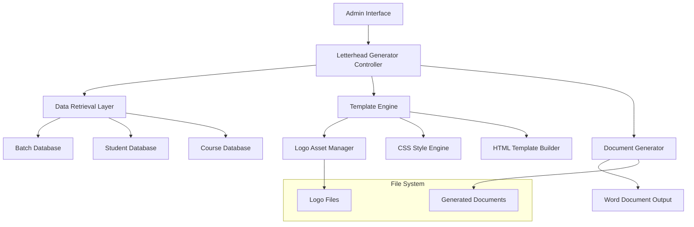

# Design Document: Letterhead-Style Word Document Generator

## Overview

The letterhead-style Word document generator is a new feature that enhances the existing admission order generation system by creating professional, government-standard documents with proper institutional branding. This system builds upon the existing simple Word generator while adding sophisticated letterhead formatting, logo integration, and bilingual header support.

The design leverages HTML-to-Word conversion techniques similar to the existing generator but incorporates advanced CSS styling for professional letterhead layout. The system maintains full compatibility with existing batch and student data structures while providing enhanced document presentation suitable for official government correspondence.

## Architecture

### System Components



### Integration Points

The letterhead generator integrates seamlessly with existing system components:

- **Authentication System**: Uses existing session management and admin authentication
- **Database Layer**: Leverages current batch, student, and course table structures
- **File System**: Utilizes existing asset directory structure for logo files
- **Batch Module**: Extends current batch management functionality
- **Download System**: Follows established file download patterns

### Technology Stack

- **Backend**: PHP 7.4+ with existing database connection patterns
- **Document Generation**: HTML-to-Word conversion using Microsoft Word-compatible HTML
- **Styling**: Advanced CSS3 for professional letterhead layout
- **Image Processing**: Base64 encoding for logo embedding
- **File Handling**: Standard PHP file operations with proper headers

## Components and Interfaces

### 1. Letterhead Generator Controller

**File**: `batch_module/admin/generate_admission_order_word_letterhead.php`

**Responsibilities**:
- Handle HTTP requests for letterhead document generation
- Validate user permissions and session state
- Coordinate data retrieval and document generation
- Set appropriate HTTP headers for Word document download

**Interface**:
```php
// GET Parameters
$batch_id = $_GET['batch_id'];     // Required: Batch identifier
$scheme_id = $_GET['scheme_id'];   // Optional: Scheme identifier

// Session Requirements
$_SESSION['admin']                 // Required: Admin authentication

// Output
// Content-Type: application/msword
// Content-Disposition: attachment; filename="..."
```

### 2. Data Retrieval Layer

**Responsibilities**:
- Fetch batch details with course and scheme information
- Retrieve student lists with complete enrollment data
- Calculate category and gender statistics
- Handle database connection errors gracefully

**Key Queries**:
```sql
-- Batch Details with Scheme Support
SELECT b.*, c.course_name, c.course_code, c.duration, c.training_fees, 
       c.course_coordinator, s.scheme_name, s.scheme_code
FROM batches b
LEFT JOIN courses c ON b.course_id = c.id
LEFT JOIN schemes s ON b.scheme_id = s.id
WHERE b.id = ?

-- Student Enrollment Data
SELECT s.id, s.name as full_name, s.father_name, s.mobile, 
       s.aadhar as aadhar_number, s.gender, s.category, 
       bs.enrollment_date, s.nielit_registration_no
FROM batch_students bs
INNER JOIN students s ON bs.student_id = s.id
WHERE bs.batch_id = ?
ORDER BY s.name
```

### 3. Logo Asset Manager

**Responsibilities**:
- Load and validate logo image files
- Convert images to base64 for HTML embedding
- Handle missing or corrupted image files
- Maintain aspect ratio and sizing

**Implementation**:
```php
class LogoAssetManager {
    private $logoPath = 'assets/images/bhubaneswar_logo.png';
    
    public function getLogoBase64() {
        if (!file_exists($this->logoPath)) {
            return null; // Graceful degradation
        }
        
        $imageData = file_get_contents($this->logoPath);
        $imageType = pathinfo($this->logoPath, PATHINFO_EXTENSION);
        
        return 'data:image/' . $imageType . ';base64,' . base64_encode($imageData);
    }
}
```

### 4. Template Engine

**Responsibilities**:
- Generate HTML structure for letterhead layout
- Apply CSS styling for professional appearance
- Handle bilingual text rendering
- Manage responsive layout for different content lengths

**Key Features**:
- Flexbox-based layout for logo and header alignment
- Professional typography with government-standard fonts
- Consistent spacing and margin management
- Table formatting for structured data presentation

### 5. Document Generator

**Responsibilities**:
- Combine template, data, and styling into final HTML
- Set Microsoft Word-compatible headers
- Generate appropriate filename with batch and date information
- Handle file download initiation

## Data Models

### Batch Data Structure

```php
$batch = [
    'id' => int,
    'batch_name' => string,
    'course_name' => string,
    'course_code' => string,
    'start_date' => date,
    'end_date' => date,
    'duration' => string,
    'training_fees' => decimal,
    'course_coordinator' => string,
    'batch_coordinator' => string,
    'scheme_name' => string,
    'scheme_code' => string,
    'admission_order_ref' => string,
    'admission_order_date' => date,
    'examination_month' => string,
    'class_time' => string,
    'location' => string,
    'copy_to_list' => text
];
```

### Student Data Structure

```php
$student = [
    'id' => int,
    'full_name' => string,
    'father_name' => string,
    'mobile' => string,
    'aadhar_number' => string,
    'gender' => enum('Male', 'Female', 'Other'),
    'category' => enum('SC', 'ST', 'OBC', 'GEN', 'PWD'),
    'enrollment_date' => date,
    'nielit_registration_no' => string
];
```

### Category Statistics Structure

```php
$category_gender_counts = [
    'SC' => ['M' => int, 'F' => int],
    'ST' => ['M' => int, 'F' => int],
    'OBC' => ['M' => int, 'F' => int],
    'GEN' => ['M' => int, 'F' => int],
    'PWD' => ['M' => int, 'F' => int]
];
```

## Correctness Properties

*A property is a characteristic or behavior that should hold true across all valid executions of a system-essentially, a formal statement about what the system should do. Properties serve as the bridge between human-readable specifications and machine-verifiable correctness guarantees.*

### Property Reflection Analysis

After analyzing all acceptance criteria, I identified several areas where properties could be consolidated:

- **Layout and Positioning**: Multiple criteria (1.2, 1.3, 3.2, 3.5) test CSS positioning and alignment - consolidated into comprehensive layout property
- **Text Content**: Multiple criteria (2.1, 2.2, 2.4) test specific text presence - consolidated into bilingual header property  
- **Professional Formatting**: Multiple criteria (5.1, 5.2, 5.3, 5.5) test CSS styling consistency - consolidated into formatting standards property
- **Data Integration**: Multiple criteria (7.1, 7.2, 7.3) test database retrieval - consolidated into data accuracy property
- **Extension Centre Logic**: Multiple criteria (8.1, 8.2, 8.3, 8.4, 8.5) test location-based customization - consolidated into single property

### Property 1: Document Structure and Layout Completeness

*For any* valid batch with students, the generated letterhead document SHALL contain all required sections (letterhead header, reference information, admission details, student table, category summary, signature section, copy-to list) with proper CSS positioning, logo alignment, and consistent spacing throughout.

**Validates: Requirements 1.1, 1.2, 1.3, 1.4, 1.5, 3.2, 3.5, 4.1, 4.2, 4.3, 4.4, 4.5, 4.6, 4.7**

### Property 2: Logo Integration and Asset Management

*For any* document generation request, the system SHALL attempt to embed the NIELIT logo from the specified file path with appropriate sizing and aspect ratio preservation; if the logo file is missing or corrupted, the document SHALL generate successfully without the logo while maintaining proper layout integrity.

**Validates: Requirements 3.1, 3.3, 3.4**

### Property 3: Bilingual Header Content Accuracy

*For any* generated document, the letterhead SHALL display the exact Hindi institutional name, English institutional name, extension centre information, and government affiliation text in the correct hierarchical order with appropriate font weights and formatting.

**Validates: Requirements 2.1, 2.2, 2.3, 2.4, 2.5**

### Property 4: Professional Formatting Standards Consistency

*For any* generated document, all elements SHALL use consistent font families, appropriate font sizes for their section type, proper margins and spacing, structured table formatting, and bold styling for headings and labels throughout the document.

**Validates: Requirements 5.1, 5.2, 5.3, 5.4, 5.5**

### Property 5: Data Accuracy and Calculation Correctness

*For any* batch and its associated students, the generated document SHALL accurately retrieve and display all database values, calculate category and gender summaries correctly, use current dates and reference numbers, and handle missing optional data gracefully without data loss or corruption.

**Validates: Requirements 7.1, 7.2, 7.3, 7.4, 7.5**

### Property 6: Extension Centre Customization Consistency

*For any* batch location value, the document SHALL display the correct extension centre information ("Bhubaneswar Extension Centre" or "Balasore Extension Centre") consistently throughout all location references including headers, signatures, and copy-to sections while maintaining consistent formatting.

**Validates: Requirements 8.1, 8.2, 8.3, 8.4, 8.5**

### Property 7: File Generation and Download Reliability

*For any* valid document generation request, the system SHALL produce a downloadable .doc file with proper HTTP headers (Content-Type: application/msword), descriptive filename including batch name and date, and maintain backward compatibility with existing systems.

**Validates: Requirements 6.1, 6.2, 6.3, 10.1, 10.2, 10.3, 10.4, 10.5**

### Property 8: Error Handling and Graceful Degradation

*For any* error condition (missing students, incomplete batch data, missing optional fields), the system SHALL either generate a valid document with appropriate defaults or display descriptive error messages while logging errors appropriately, without system crashes or data corruption.

**Validates: Requirements 9.3, 9.5**

## Error Handling

### Database Connection Errors

- **Detection**: Check database connection status before queries
- **Response**: Display user-friendly error message and log technical details
- **Recovery**: Provide retry mechanism or fallback to cached data

### Missing Student Data

- **Detection**: Validate student count after database query
- **Response**: Display "No students found for this batch" message
- **Recovery**: Suggest checking batch configuration or student enrollment

### Logo File Issues

- **Detection**: Check file existence and readability
- **Response**: Generate document without logo, maintain layout integrity
- **Recovery**: Log missing file for administrative attention

### Invalid Batch Parameters

- **Detection**: Validate batch_id parameter and database record existence
- **Response**: Display "Batch not found" error message
- **Recovery**: Redirect to batch selection interface

### Permission Violations

- **Detection**: Check admin session and role permissions
- **Response**: Display "Unauthorized access" message
- **Recovery**: Redirect to login page

## Testing Strategy

### Dual Testing Approach

The letterhead Word generator will use a comprehensive testing strategy combining unit tests for specific scenarios and property-based tests for universal behaviors:

- **Unit tests**: Verify specific examples, edge cases, and error conditions
- **Property tests**: Verify universal properties across all valid inputs
- **Integration tests**: Verify end-to-end document generation and Microsoft Word compatibility

### Property-Based Testing Implementation

**Framework**: PHPUnit with custom property test generators
**Configuration**: Minimum 100 iterations per property test
**Test Data Generation**: Custom generators for batch data, student lists, and system states

**Property Test Structure**:
```php
/**
 * Feature: letterhead-word-generator, Property 1: Document Structure and Layout Completeness
 * For any valid batch with students, the generated letterhead document SHALL contain 
 * all required sections with proper CSS positioning, logo alignment, and consistent spacing.
 */
public function testDocumentStructureCompleteness() {
    for ($i = 0; $i < 100; $i++) {
        $batch = $this->generateRandomBatch();
        $students = $this->generateRandomStudents(rand(1, 200));
        
        $document = $this->letterheadGenerator->generate($batch, $students);
        
        $this->assertContainsRequiredSections($document);
        $this->assertProperCSSPositioning($document);
        $this->assertConsistentSpacing($document);
    }
}
```

### Unit Testing Coverage

**Data Layer Testing**:
```php
// Specific batch configurations
testBatchDataRetrieval_ValidBatch_ReturnsCompleteData()
testBatchDataRetrieval_MissingScheme_UsesDefaults()
testStudentDataRetrieval_EmptyBatch_ReturnsEmptyArray()

// Category calculation edge cases
testCategoryCalculation_AllSameCategory_ReturnsCorrectCounts()
testCategoryCalculation_MixedGenders_ReturnsAccurateSummary()
testCategoryCalculation_UnknownCategory_DefaultsToGeneral()
```

**Logo Asset Management**:
```php
// File system scenarios
testLogoEmbedding_ValidPNG_ReturnsBase64Data()
testLogoEmbedding_MissingFile_ReturnsNullGracefully()
testLogoEmbedding_CorruptedFile_HandlesError()
testLogoEmbedding_LargeFile_ProcessesEfficiently()
```

**Error Handling Scenarios**:
```php
// Database error conditions
testDocumentGeneration_DatabaseConnectionFail_DisplaysError()
testDocumentGeneration_InvalidBatchId_ReturnsNotFound()
testDocumentGeneration_NoStudents_ShowsDescriptiveMessage()

// Permission and authentication
testDocumentGeneration_NoSession_ReturnsUnauthorized()
testDocumentGeneration_InvalidPermissions_DeniesAccess()
```

### Integration Testing Approach

**End-to-End Workflow Testing**:
- Complete document generation with real database data
- HTTP response validation and file download testing
- Cross-browser compatibility for download functionality
- Microsoft Word compatibility verification

**Database Integration Testing**:
```php
// Real database scenarios
testCompleteWorkflow_RealBatch_GeneratesValidDocument()
testCompleteWorkflow_LargeBatch_HandlesPerformance()
testCompleteWorkflow_MultipleSchemes_ProcessesCorrectly()
```

**File System Integration**:
```php
// Asset and output file handling
testFileGeneration_ValidRequest_CreatesDownloadableFile()
testFileGeneration_ConcurrentRequests_HandlesMultipleUsers()
testAssetLoading_NetworkDrive_AccessesRemoteAssets()
```

### Manual Testing Requirements

**Document Quality Verification**:
- [ ] Open generated .doc files in Microsoft Word 2016, 2019, 365
- [ ] Verify logo positioning and sizing across Word versions
- [ ] Confirm bilingual text rendering (Hindi and English fonts)
- [ ] Check table formatting and data alignment
- [ ] Validate professional appearance and government standards compliance

**Cross-Platform Testing**:
- [ ] Windows 10/11 with various Word versions
- [ ] macOS with Microsoft Word for Mac
- [ ] LibreOffice Writer compatibility testing
- [ ] Google Docs import functionality

**Browser Compatibility**:
- [ ] Chrome: File download and MIME type handling
- [ ] Firefox: Download behavior and file associations
- [ ] Safari: macOS download functionality
- [ ] Edge: Windows integration and file handling

### Performance Testing Benchmarks

**Response Time Targets**:
- Small batch (1-25 students): < 2 seconds
- Medium batch (26-100 students): < 5 seconds  
- Large batch (101-300 students): < 10 seconds
- Error responses: < 1 second

**Load Testing Scenarios**:
```php
// Concurrent generation testing
testConcurrentGeneration_10Users_MaintainsPerformance()
testConcurrentGeneration_50Users_HandlesLoad()

// Large dataset processing
testLargeDataset_500Students_ProcessesEfficiently()
testLargeDataset_MultipleCategories_CalculatesAccurately()
```

**Memory Usage Monitoring**:
- Base64 logo encoding memory impact
- Large student list processing efficiency
- Concurrent request memory isolation
- Memory leak detection during extended testing

### Accessibility and Compliance Testing

**Document Accessibility**:
- Screen reader compatibility when opened in Word
- Proper heading structure for navigation
- Alt text for embedded logos
- Color contrast compliance for printed documents

**Government Standards Compliance**:
- Official letterhead format verification
- Bilingual content presentation standards
- Professional document appearance guidelines
- Signature and authorization section requirements

### Automated Testing Pipeline

**Continuous Integration**:
```yaml
# PHPUnit test execution
- Unit tests: All property and unit tests
- Integration tests: Database and file system tests
- Performance tests: Response time validation
- Code coverage: Minimum 90% coverage requirement
```

**Test Data Management**:
- Automated test database setup and teardown
- Sample batch and student data generation
- Logo asset availability verification
- Test environment isolation and cleanup